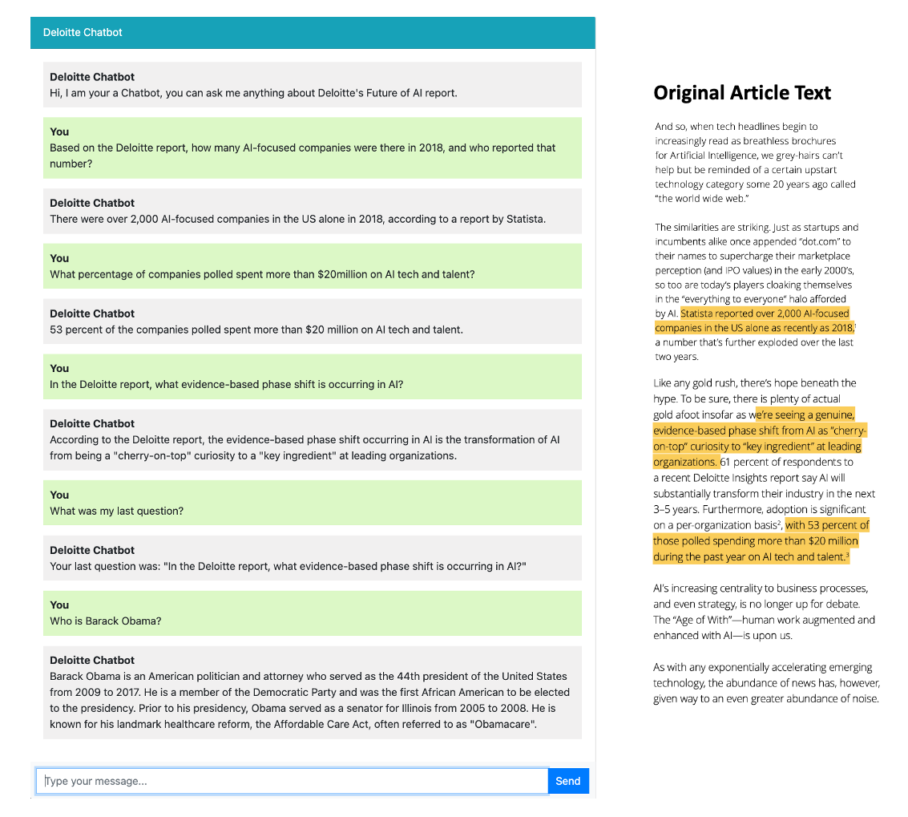
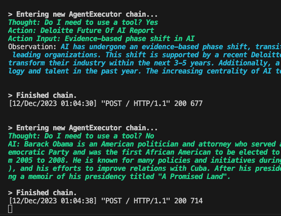
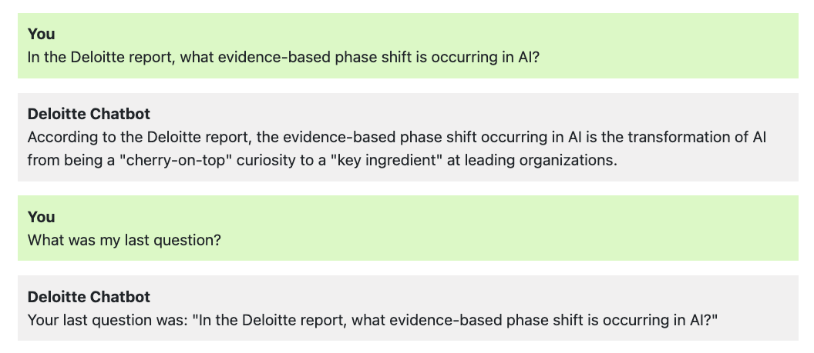

# RAG-chatbot

## Proof of Concept for a knowledge chatbot using Retrieval Augmented Generation (RAG) techniques.
This is a proof of concept of using RAG techniques to add 3rd party information to an LLM. It is agentic, has memory, and a number of advanced & emerging RAG techniques were experimented on. A simple chat UI was built to facilitate the question and answering.

### Architecture 
**It is built using the following architecture**
- The RAG system built on Langchain for orchestrating agents, LlamaIndex for retrieval, pgvector for vectorstore, OpenAI for embeddings & llm.
- Django backend.
- Simple chat frontend using basic html, bootstrap css, and javascript.

### Features 
The agentic behavior of the RAG system **autonomously decides whether or not the 'Deloitte Future of AI Report' tool needs to be used** to answer the user's query. Here in the console log, you can see the LLM first considering whether or not it is appropriate to search the report to answer the user's query.

It also **holds memory of the previous conversation** so that it can keep track of conversation context. Here you can see that it remembers a user prompt from the previous conversation. It is currently given a rolling six messages (k=6) of additional memory context.

### Experimentation on advanced RAG 
Finally, within rag-chatbot/django_chatbot/chatbot/doc_loader, several advanced retrieval techniques were tested including:

- *Small to large retrieval*: Embed in small chunks, but feed context to llm with expanded window for more performant retrieval.
- *Recursive retrieval*: Creates mechanisms to choose either to conduct semantic search, or summarization tasks, since they are different kinds of tasks.
- *Subquery engine*: First breaks user query into sub-questions, and then answers each question individually.
- *Retrieval using Graph Search*: In progress... Working on experimenting building a knowledge graph using Neo4J for querying.

